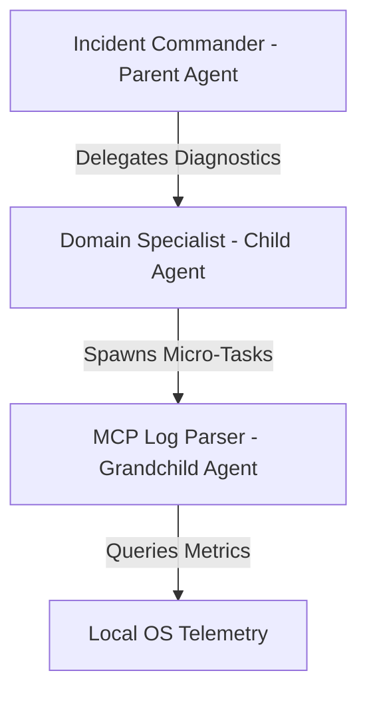

# Autonomous SRE Swarm Orchestration Blueprint

This folder contains the core multi-agent orchestration files for FractalSwarm SRE. It serves as a blueprint showing how to design, coordinate, and execute stateful AI agent trees with human-in-the-loop gates using the **Mastra** framework.

---

## 📂 Blueprint Files
* `workflow.ts`: The core SRE Workflow state machine configuration, including step controls, rate-limit queueing, and retry fallbacks.
* `agent.ts`: The Parent Commander agent definition and tool signatures.
* `grandchild.ts`: The Child/Grandchild agent definitions and dynamic factory initialization.
* `mcp_tools.ts`: Integrations for local system telemetry and log file MCP tools.

---

## 🧠 SRE Agent Swarm Topology

Instead of using a single large agent (which leads to context confusion, high token usage, and high failure rates), tasks are delegated down an air-gapped agent tree:

### 1. Parent Agent (Incident Commander)
* **Role:** Global coordinator.
* **Responsibilities:** Receives the initial alert, initiates the child/grandchild swarm, analyzes final consolidated diagnostics, drafts the mitigation playbook, audits safety, and prompts the human operator for approval.
* **LLM Engine:** Gemini 2.5 Flash / Gemini 2.5 Pro.

### 2. Child Agent (Domain Specialist)
* **Role:** Specialist agent.
* **Responsibilities:** Dynamically spawned depending on the incident domain (e.g., Database Recovery Specialist, System Storage Specialist, Network Specialist).
* **LLM Engine:** Gemini 2.5 Flash.

### 3. Grandchild Agent (MCP Log Parser)
* **Role:** Low-level execution worker.
* **Responsibilities:** Accesses target files, parses system metrics, and returns plain-text logs. Run-to-completion model.
* **Tools:** `mcp-read-log-file`, `mcp-get-system-metrics`.

---

## ⚡ Concurrency & Quota Protection Architecture

To run reliably on standard LLM provider APIs (such as Gemini's free tier) without encountering `429 (Resource Exhausted)` crashes, the blueprint implements two critical patterns:

### 1. Sequential Routing Queue
In the API gateway router (`routes.ts`), incoming triggers are managed by a custom `ConcurrencyQueue` set to `1`. Even if a monitoring storm bursts 12 alerts simultaneously, they are processed in order, protecting LLM request limits.

### 2. Exponential Backoff Retries
All agent `.generate()` calls inside the workflow steps are wrapped with a `retryWithBackoff` helper that catches transient 429 quota exceptions, logs warning events, and retries with escalating delays (`3s`, `6s`, `12s`, `24s`...) up to 5 times.

### 3. Graceful Local Fallback
If API limits are completely exhausted (e.g., daily quotas), the workflow catches the error and falls back to a smart, domain-specific rule-based diagnostic engine. This engine extracts line metadata and generates custom playbooks with zero downtime.
